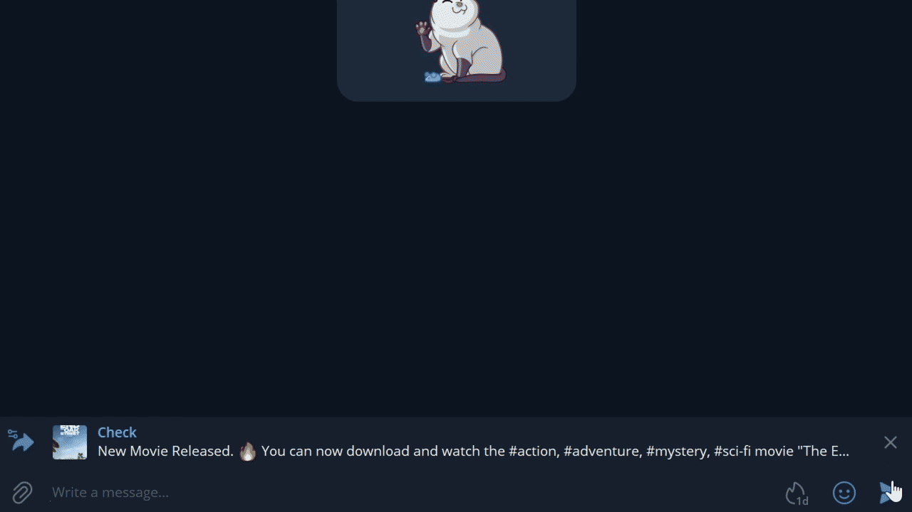
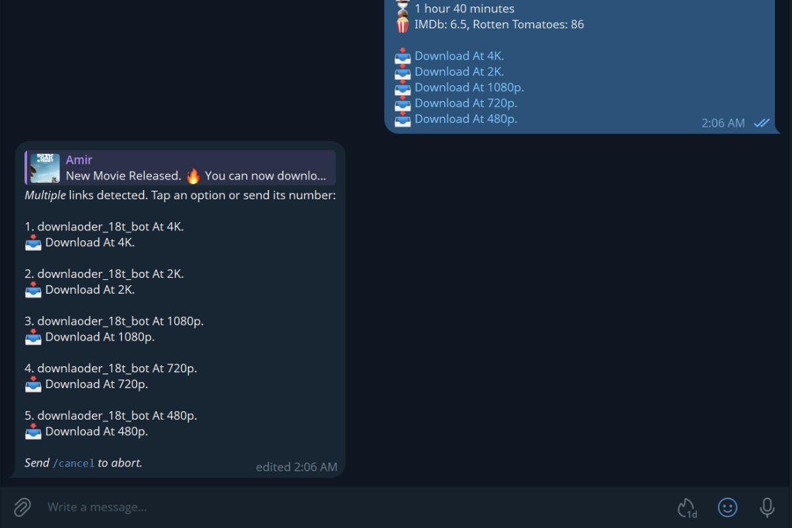
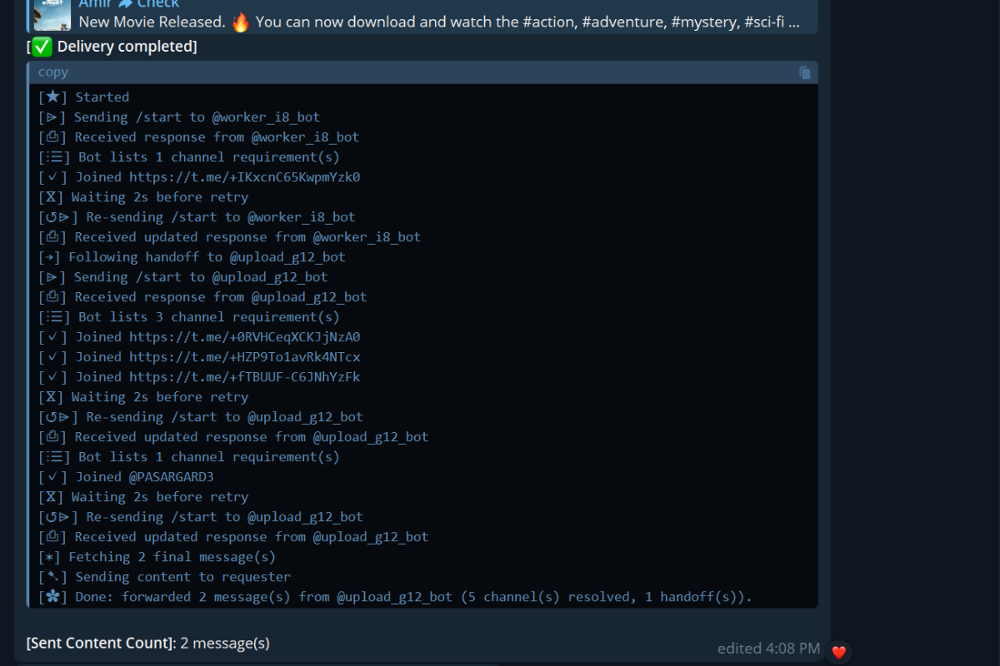

### Hero Media Recommendation & Asset Specs

* **Hero choice:** Use an **animated GIF or short looping MP4/WebM**. An anti-channel-gate bot is inherently about the speed and transition—seeing a forwarded link instantly transform into a clean video without subscribing creates an immediate "aha!" moment.
* **Aspect ratio & sizes:**
* **Hero GIF / Video:** `1280 × 640 px` (2:1 ratio) or standard `1280 × 720 px` (16:9). Keep file size under `5 MB` so it loads instantly on GitHub mobile and desktop.
* **UI Screenshots / Demos:** `1200 × 800 px` or native Retina Telegram desktop captures framed with a subtle border/shadow.


---

### `README.md`

```markdown
<div align="center">

# ⚡ fuckjoin

### Tired of joining 10 garbage Telegram channels just to watch one video? We are too.

Send any bot link. Get your video. Never join a spam channel again.

[](https://python.org)
[](https://github.com/LonamiWebs/Telethon)
[](LICENSE)

---

<!-- HERO ASSET: Recommended Size: 1280x640px or 1280x720px (Optimized GIF / WebM under 5MB) -->


</div>

---

## 💡 What is fuckjoin?

Telegram is flooded with file lockers demanding:
> *"You must join Channel A, Channel B, and Channel C to view this content."*

**fuckjoin automates the pain away:**
1. **You send a bot link** (or forward a message containing one).
2. **fuckjoin joins the requirements in the background** via an isolated session.
3. **Pulls the target video/files**, delivers them straight to your private chat.
4. **Auto-cleans the junk:** Silently leaves channels afterward so your account stays spotless.

---

## ⚡ Visual Walkthrough

<div align="center">

| 1. Send Link or Tap Option | 2. Real-Time Relay & Cleanup |
|:---:|:---:|
| <!-- Screenshot Size: 600x400px -->  | <!-- Screenshot Size: 600x400px -->  |
| Multi-link selector menus with instant tap | Live progress cards with instant `/cancel` |

</div>

---

## ✨ Features

- 🎯 **Deep Link Unlocking:** Resolves nested bot handoffs, start parameters, and multi-step verification bots.
- ⚡ **Auto Channel Cleanup:** Silently tracks joined channels in persistent storage and leaves them in the background.
- 🛡️ **FloodWait Resilience:** Automatically absorbs and paces API rate limits without dropping in-flight jobs.
- ⊘ **Instant Cancellation:** Interrupt any task on the fly by clicking or typing `/cancel`.
- 👥 **Access Control:** Manage dynamic permissions on the fly using `/add_user` and `/state` without restarting.

---

## 🚀 Quick Start

### 1. Clone & Set Up

```bash
git clone [https://github.com/yourusername/fuckjoin.git](https://github.com/yourusername/fuckjoin.git)
cd fuckjoin
python -m venv .venv
source .venv/bin/activate  # On Windows: .venv\Scripts\activate
pip install -r requirements.txt

```

### 2. Configure Credentials

Get your API credentials from [my.telegram.org](https://my.telegram.org):

```bash
cp .env.example .env

```

Edit `.env` and fill in your details:

```env
API_ID=12345678
API_HASH=abcdef1234567890abcdef1234567890
ADMINS=your_telegram_numeric_id

```

### 3. Run

```bash
python -m src

```

*On your first start, Telethon will ask you to enter your phone number and verification code to create your local session.*

---

## 🛠️ Usage & Commands

| Command | Who Can Use | Description |
| --- | --- | --- |
| `https://t.me/bot?start=...` | Admins & Allowed Users | Paste or forward any bot link to fetch content |
| `/cancel` or `cancel` | Admins & Allowed Users | Aborts the active running download immediately |
| `/admin` | Admins Only | Shows the admin dashboard and quick buttons |
| `/state` | Admins Only | Displays active jobs, queue count, and authorized user IDs |
| `/add_user <user_id>` | Admins Only | Grants bot access to a user |
| `/remove_user <user_id>` | Admins Only | Revokes a user's bot access |

---

## 📖 Deep Dive

Curious about channel rotation cycles, transient bot response filtration, or concurrency architecture?

Check out **[TECHNICAL.md](https://www.google.com/search?q=TECHNICAL.md)**.

---

## ⚖️ Disclaimer

*fuckjoin is designed as a personal workflow automation utility under Telegram's Terms of Service. Please respect content rights and adhere to community guidelines.*

```

---

### `TECHNICAL.md`

Create this companion file in the root directory for technical contributors:

```markdown
# 🔧 Technical Architecture & Internals

This document covers the internal design, concurrency model, and rate-limiting safeguards built into **fuckjoin**.

---

## 1. Concurrency & Delivery Pipeline


```

[Inbound Message]
│
▼
[Parser: links.py] ──> Extracts Bot Start Links & Formatted Entities
│
▼
[Task Queue: asyncio.Queue] (Max Size: 100)
│
▼
[Delivery Worker] ──> Sequential Task Execution
│
├─► [client.conversation()] ──> Solves Start/Join Gate
├─► [ChannelTracker]        ──> Records & Timestamps Joined Channels
├─► [Saved Messages Backup] ──> Immediate relay to prevent auto-delete
└─► [safe_forward_messages] ──> Chunks & delivers to final recipient

```

---

## 2. Gate Resolution (`run_bot_flow`)

- **Transient Filters:** Ignores progress spinners or dummy loading replies (e.g., `"Please wait..."`, `"⏳"`) via configurable strings in `TRANSIENT_TEXTS`.
- **Recursive Handoffs:** Follows redirects across up to 5 nested bots (`MAX_BOT_HANDOFFS`) when services hand off file generation to secondary bot instances.
- **Backoff & Rate Limiting:** Enforces `JOIN_PACING_DELAY_SECONDS` between channel subscriptions to prevent account restriction.

---

## 3. Storage & Cleanup Routine

- **Joined Channels (`data/joined_channels.json`):** Tracks each channel ID alongside its subscription epoch. A background cleanup worker checks every 60 seconds and automatically leaves channels older than 24 hours or when the subscription threshold exceeds `MAX_JOINED_CHANNELS`.
- **Access Control (`data/allowed_users.json`):** Synchronously locked file-backed registry allowing realtime permission updates without service interruption.

---

## 4. FloodWait & Cancellation Architecture

- **`interruptible_sleep()`:** Replaces standard `asyncio.sleep()` calls with `asyncio.wait_for()` on an `asyncio.Event` flag. If the user invokes `/cancel`, long delays (including FloodWait waits) abort immediately.
- **Batched Delivery:** Content relays forward messages in chunks of 5 with pacing to avoid hitting chat forward limits.

```